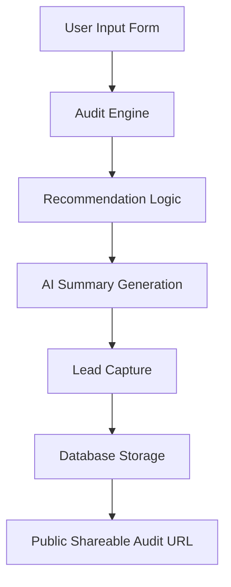

# ARCHITECTURE.md

## Stack Choice

I chose Next.js with TypeScript because the project required:
- fast iteration
- server/client rendering flexibility
- API routes
- strong typing
- SEO support
- Open Graph metadata support
- easy deployment on Vercel

TypeScript helped reduce runtime issues while working with dynamic pricing data and audit logic.

Tailwind CSS was used for fast UI iteration and consistent styling.

---

## System Diagram

---

## System Flow

User Input
→ Audit Engine
→ Recommendation Logic
→ AI Summary Generation
→ Result Storage
→ Shareable Public URL

---

## Data Flow

1. User submits AI tooling and spend information
2. The audit engine evaluates pricing efficiency and recommendations
3. The system calculates monthly and annual savings
4. Gemini generates a personalized summary
5. Audit results are optionally stored and shared via public URLs

---

## Why Rule-Based Audit Logic

The audit engine itself is deterministic rather than AI-generated because pricing recommendations need to remain financially defensible and predictable.

AI is only used for personalized summaries.

---

## Security and Abuse Protection

The application includes basic abuse protection using rate limiting to reduce spam and excessive API usage.

Sensitive keys are stored using environment variables and are never committed to the repository.

---

## Scalability Considerations

If the application needed to support 10k+ audits/day, I would:
- move pricing logic into isolated services
- add caching for pricing data
- use queue-based summary generation
- add database indexing for audit retrieval
- introduce monitoring and rate limiting

I would also separate the audit engine and summary generation into independent services to reduce load on the main application.