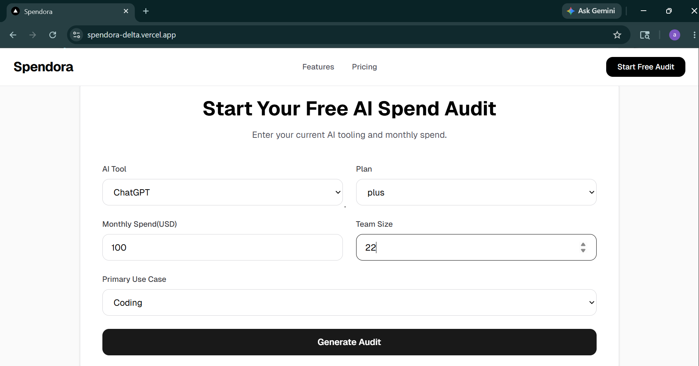
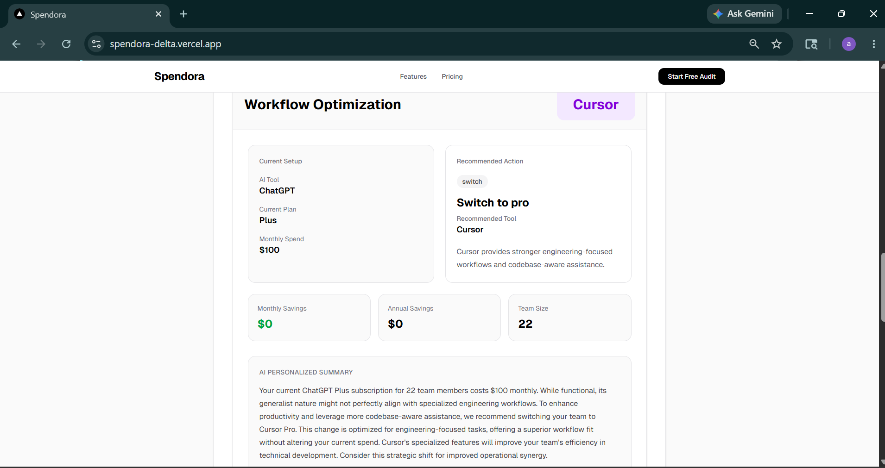
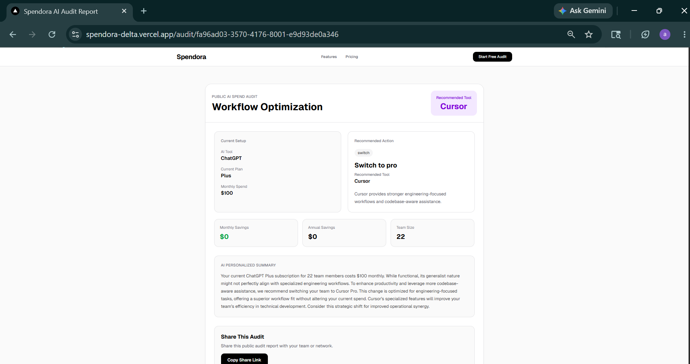
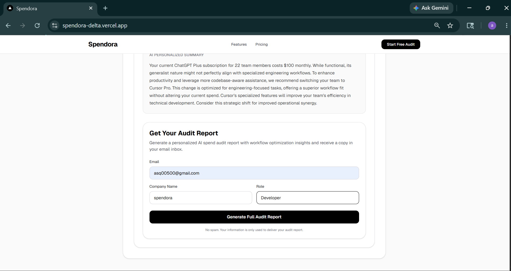

# Spendora

Spendora is an AI spend audit platform built for startups and engineering teams to analyze AI tooling costs, identify overspending, and discover better pricing plans through intelligent audit recommendations.

Built as part of the Credex Web Development Internship Assignment.

---

## Live Demo

- Deployment: https://spendora-delta.vercel.app/
- GitHub Repository: https://github.com/afsal-ak/spendora
---

## Features

### AI Spend Audit Engine
- Analyze AI tool usage and monthly spend
- Compare plans across multiple AI vendors
- Generate savings recommendations based on usage fit
- Calculate estimated monthly and annual savings

### Multi-Platform Pricing Support
Supports pricing analysis for:
- Cursor
- ChatGPT
- Claude
- Gemini
- GitHub Copilot
- OpenAI API
- Anthropic API
- Windsurf

### AI-Generated Audit Summaries
- Gemini-powered personalized summaries
- Server-side AI summary generation
- Graceful fallback handling for API failures

### Shareable Public Audit Reports
- Unique public audit URLs
- Sensitive user information excluded from public pages
- Open Graph and Twitter preview support

### Lead Capture & Email Delivery
- Lead capture workflow
- Transactional email delivery using Resend
- Backend audit storage with Supabase

### Abuse Protection
- IP-based rate limiting
- Honeypot spam prevention

### UX Improvements
- LocalStorage persistence
- Responsive UI
- Loading states
- Validation feedback
- Regenerate audit workflow

---

## Screenshots

### Landing Page


### Audit Form



### Audit Results



### Public Audit Report



### Lead Capture Flow



---

## Tech Stack

### Frontend
- Next.js
- React
- TypeScript
- Tailwind CSS

### Backend & APIs
- Next.js Route Handlers
- Gemini API
- Resend
- Supabase

### Forms & Validation
- React Hook Form
- Zod

### Deployment
- Vercel

---

## Getting Started

Clone the repository:

```bash
git clone https://github.com/afsal-ak/spendora
```

Navigate into the project:

```bash
cd spendora
```

Install dependencies:

```bash
npm install
```

Run the development server:

```bash
npm run dev
```

Open:

```txt
http://localhost:3000
```

---

## Environment Variables

Create a `.env.local` file and add:

```env
NEXT_PUBLIC_APP_URL=

GEMINI_API_KEY=
GEMINI_MODEL=gemini-1.5-flash

SUPABASE_SERVICE_ROLE_KEY=
SUPABASE_URL=

RESEND_API_KEY=
```

---

## Project Structure

```txt
src/
 ├── app/
 ├── components/
 ├── constants/
 ├── hooks/
 ├── lib/
 ├── prompts/
 ├── schemas/
 ├── services/
 ├── tests/
 ├── types/
 └── utils/
```

---

## Decisions & Trade-offs

### 1. Hardcoded Audit Logic Instead of AI
The audit recommendation engine uses deterministic pricing and recommendation rules instead of AI-generated pricing analysis. This keeps recommendations transparent, financially explainable, and easier to test.

### 2. AI Used Only for Personalized Summaries
AI is used only for generating personalized audit summaries while the actual audit calculations remain deterministic and rule-based.

### 3. Lightweight Abuse Protection
Implemented:
- IP-based rate limiting
- Honeypot spam prevention

instead of heavier CAPTCHA solutions to keep the MVP frictionless while still reducing automated abuse.

### 4. LocalStorage Persistence Instead of Authentication
Form state and generated results are persisted locally to improve UX without introducing authentication complexity during MVP scope.

### 5. Supabase for Rapid Backend Iteration
Used Supabase for audit storage and public report retrieval to accelerate backend development and simplify deployment architecture.

---

## Key Engineering Decisions

### Fallback Summary Handling
Implemented fallback summaries to ensure audit generation remains functional even if the external AI provider fails or quota limits are reached.

### Public Shareable Audit URLs
Audit result pages expose only non-sensitive audit information while excluding identifying details like email and company information.

### Reusable Form Architecture
Used React Hook Form and Zod to create scalable and reusable validation architecture across forms.

### Server-Side AI Generation
Moved AI summary generation into secure server-side API routes to avoid exposing API keys to the client.

---

## Challenges Faced

- Anthropic API billing limitations during testing
- Managing AI fallback UX flows
- Structuring scalable pricing logic across multiple AI vendors
- Designing recommendation logic that feels financially reasonable
- Balancing MVP scope with production-style architecture

---

## Future Improvements

- PDF audit export
- Benchmark analytics
- Referral system
- Embedded audit widget
- Audit history dashboard
- More advanced pricing intelligence

---

## Running Tests

Run all tests:

```bash
npm run test
```

Run linting:

```bash
npm run lint
```

Build for production:

```bash
npm run build
```

---

## CI/CD

GitHub Actions workflow automatically runs:
- lint checks
- automated tests
- production build verification

on every push and pull request to `main`.

---

## Project Status

Completed MVP submission for the Credex Web Development Internship Assignment.

---

## Author

Mohammed Afsal